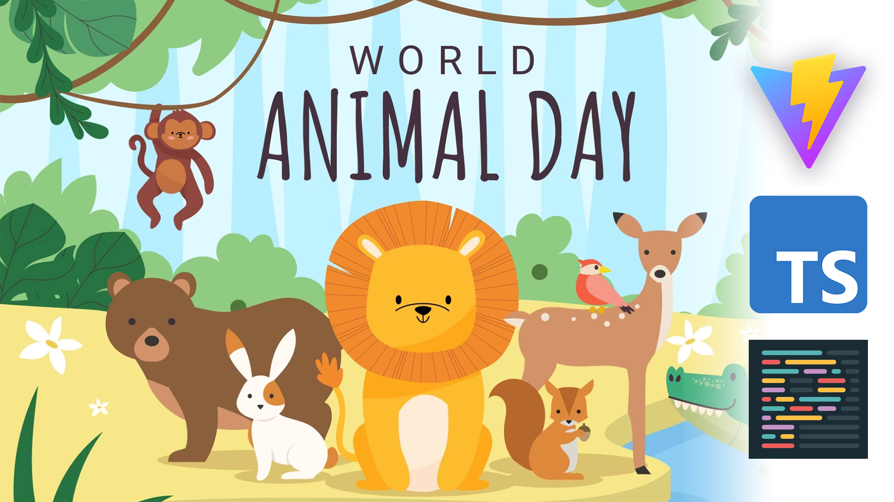

# tutorial-dnd-animals
Детская интерактивная пазл игра с животными на TypeScript, написанная с целью обучения, где мы попытаемся разбить портянку кода и создать свою Архитектуру проекта, придерживаясь ООП стиля программирования.

Сложность: :full_moon: :full_moon: :full_moon: :last_quarter_moon: :new_moon:

Image by <a href="https://www.freepik.com/free-vector/world-animal-day-flat-design-background_31240982.htm#&position=0&from_view=search&track=ais">Freepik</a>

## Список уроков
- Урок 0: Подготовка проекта. Установка Vite, Prettier и Konva. 
  :tv: [YouTube](https://www.youtube.com/watch?v=HO6wBG8FFqo)
  
- Урок 1: SVG нарезка и содание отдельных файлов c животными. Подготовка файла источника **sources** с набором координат. 
  :tv: [YouTube](https://www.youtu.be/k87xvt_7WcM) :octocat: [git-branch-tutorial-01](https://github.com/yesworld/tutorial-dnd-animals/tree/tutorial1-add-svg-animals-to-project)

- Урок 2: Создание ImageLoaderService по загрузке изображений. Добавление типов для TS. 
  :tv: [YouTube](https://www.youtube.com/watch?v=rzPTPMg2E30) :octocat: [git-branch-tutorial2-create-image-loader-service](https://github.com/yesworld/tutorial-dnd-animals/tree/tutorial2-create-image-loder-service)

- Урок 3: Применяем пораждающий паттерн Билдер (Builder). Приводим проект к ООП стилю. 
  :tv: [YouTube](https://youtu.be/kjj_4czV--c) :octocat: [git-branch-tutorial3-create-game-builder](https://github.com/yesworld/tutorial-dnd-animals/tree/tutorial3-create-game-builder)
