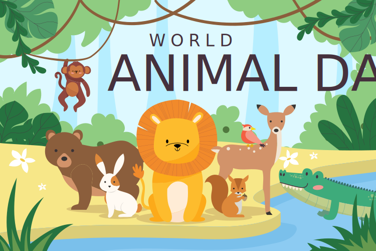

# tutorial-dnd-animals
Детская интерактивная пазл игра с животными на TypeScript, написанная с целью обучения.

Image by <a href="https://www.freepik.com/free-vector/world-animal-day-flat-design-background_31240982.htm#&position=0&from_view=search&track=ais">Freepik</a>

## Список уроков
- Урок 0: Подготовка проекта. Установка Vite, Prettier и Konva.
- Урок 1: SVG нарезка и содание отдельных файлов c животными. Подготовка файла источника **sources** с набором координат. [git-branch](https://github.com/yesworld/tutorial-dnd-animals/tree/tutorial1-add-svg-animals-to-project)

